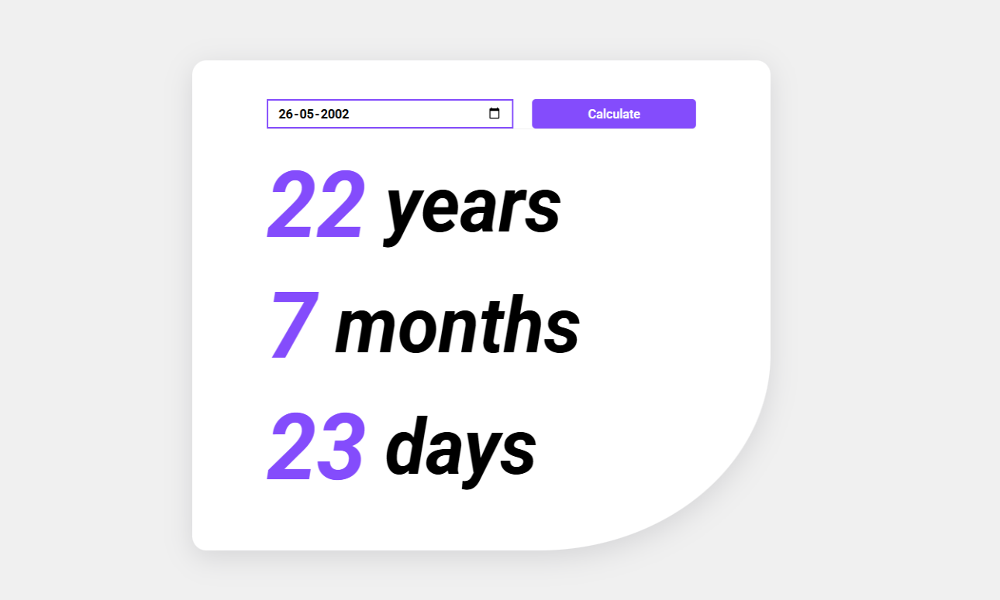

# Age Calculator App

A lightweight, interactive web application that calculates your age in years, months, and days based on your date of birth. 

## Features
- Input your date of birth using a date picker.
- Calculates and displays age in years, months, and days.
- Provides error handling for invalid or empty input.

## Tech Stack
- **HTML**: For structure and layout.
- **CSS**: For styling and responsive design.
- **JavaScript**: For calculations and interactivity.

## Demo
[Live Demo](https://naveen-kumarj.github.io/age-calculator-app/) 🚀
